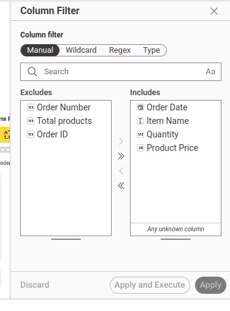
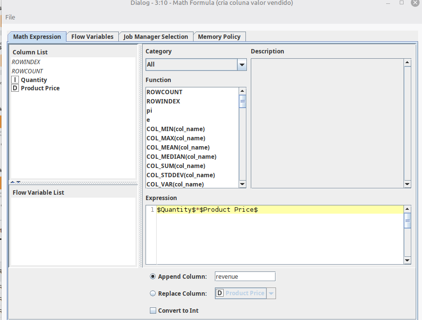
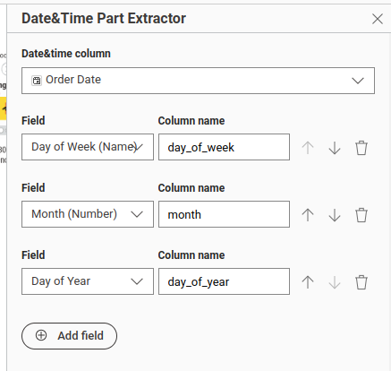
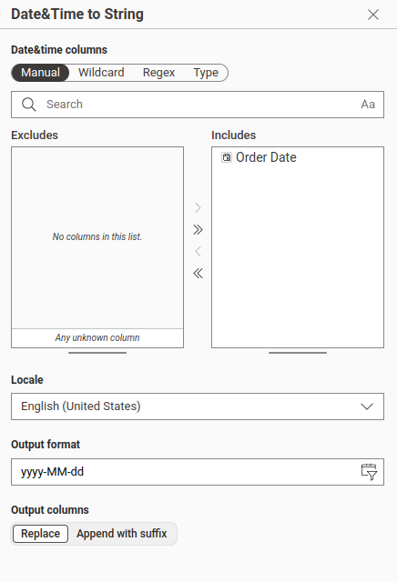
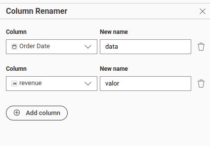
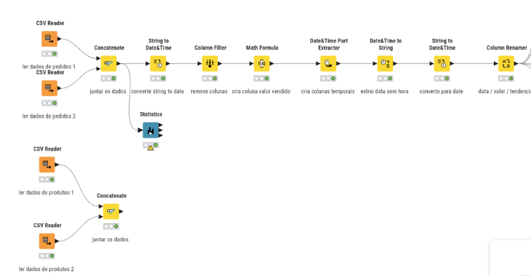
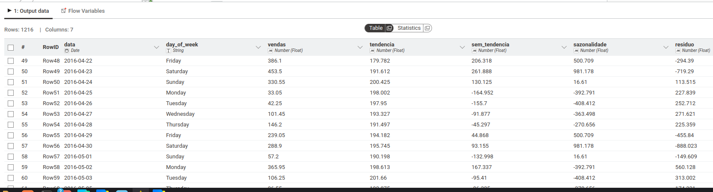
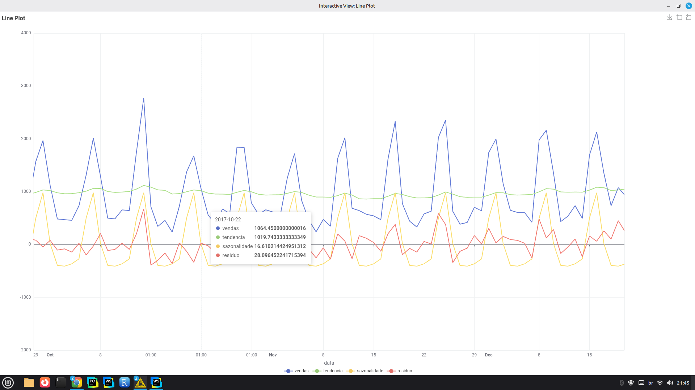
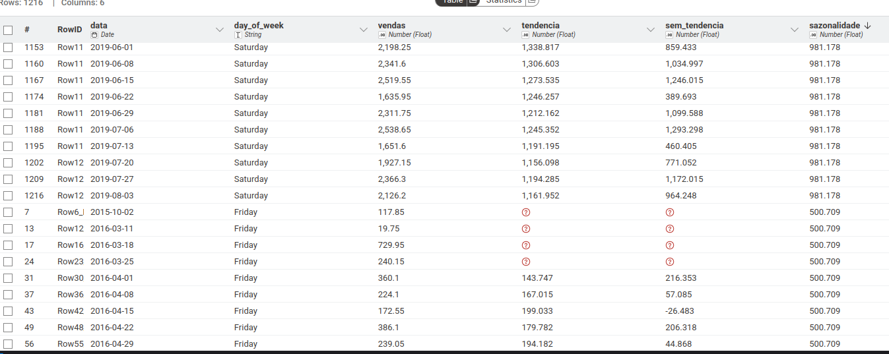
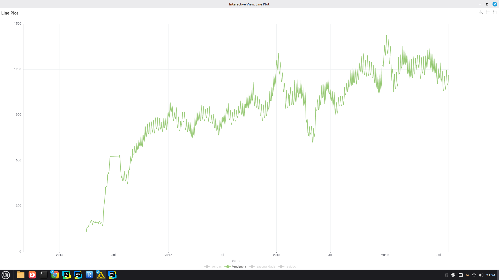

Este trabalho esta disponível no git: https://github.com/echer/26E2-infnet-trabalho-pd-mineracao-de-dados-para-series-temporais.git.

Este trabalho tem como objetivo aplicar técnicas de mineração de dados para séries temporais utilizando a plataforma KNIME. Foram utilizadas técnicas de análise exploratória, decomposição temporal, autocorrelação e modelagem ARIMA para análise e previsão de séries temporais.

A base de dados escolhida contém informações de pedidos realizados em um restaurante ao longo do tempo. Essa base foi selecionada por possuir uma variável temporal (Order Date) e diversas variáveis quantitativas relacionadas às vendas, tornando-a adequada para análise de séries temporais.

Além disso, a base apresenta forte comportamento sazonal, variações de demanda e tendência temporal, características importantes para aplicação de técnicas de previsão e decomposição temporal.

# Dataset
Para este trabalho estou utilizando o dataset do kaggle `Takeaway Food Orders` disponível no link: https://www.kaggle.com/datasets/henslersoftware/19560-indian-takeaway-orders.

# Estrutura dos dados
| Variável       | Tipo       | Descrição                              |
| -------------- | ---------- | -------------------------------------- |
| Order Number   | Discreta   | Número identificador do pedido         |
| Order Date     | Temporal   | Data e hora do pedido                  |
| Item Name      | Categórica | Nome do produto vendido                |
| Quantity       | Discreta   | Quantidade vendida do item             |
| Product Price  | Contínua   | Preço unitário do produto              |
| Total Products | Discreta   | Quantidade total de produtos no pedido |
| Order ID       | Discreta   | Identificador único do pedido          |

| Variável       | Média      | Desvio Padrão | Mínimo | Máximo |
| -------------- | ---------- | ------------- | ------ | ------ |
| Order Number   | 9.115,548  | 4.052,163     | 630    | 16.118 |
| Quantity       | 1,247      | 0,732         | 1      | 32     |
| Product Price  | 5,177      | 3,260         | 0,5    | 17,95  |
| Total Products | 7,125      | 3,375         | 1      | 60     |
| Order ID       | 15.185,998 | 6.088,428     | 2.096  | 25.583 |

As variaveis `Order Number`, `Order ID`, `Total Products` foram removidas no knime.

Foi criado uma nova coluna com o total chamada: `revenue`, multiplicando o `Quantity` pelo `Product Price`

A partir da coluna `Order Date` foi criado as colunas: `day_of_week`, `month`, `day_of_year`.

Os dados da coluna `Order Date` também foi modificada removendo a hora e deixando apenas a data. Antes yyyy-MM-dd HH:mm, após apenas yyyy-MM-dd.

As colunas `Order Date` e `revenue` foram renomeadas para `data`, `valor`.

E esta foi a análise inicial realizada no knime:

A partir dos dados prontos foram feitos a decomposição manual da coluna `valor` nas colunas `tendencia`, `sem_tendencia`, `sazonalidade` e `residuo`.

### Existe sazonalidade nas vendas do restaurante ao longo da semana?
A análise temporal permitiu identificar padrões repetitivos de consumo, mostrando quais dias da semana apresentam maior ou menor volume de vendas. No presente trabalho, observou-se forte sazonalidade semanal, com aumento significativo das vendas aos finais de semana, principalmente sexta e sábados.

### As vendas do restaurante apresentam tendência de crescimento ou queda ao longo do tempo?
A decomposição temporal permitiu identificar a tendência da série temporal utilizando médias móveis. Com isso, foi possível verificar o comportamento de longo prazo das vendas e analisar um leve crescimento no faturamente ao longo da serie temporal.

# TODO CONTINUAR AQUI

Com suas palavras explique:
Processo estocástico
Processo determinístico
Sazonalidade estocástica
Sazonalidade determinística
Sazonalidade aditiva vs multiplicativa
Em relação à base escolhida:
Faça gráficos onde cada variável não sequencial é usada no eixo-Y e a sequencial é o eixo-X
Faça um gráfico de autocorrelação para cada uma das variáveis (ACF Plot)
Faça um gráfico de correlação parcial para cada uma das variáveis (PACF Plot)
Decomponha as variáveis em: Tendência, Sazonalidade e Resíduo. Faça um gráfico
Construa um modelo ARIMA para cada variável da base de dados e faça uma previsão (forecast) baseado nele. Use Akaike Information Critera para definir o melhor modelo ARIMA possível. Análise o resíduo do modelo de predição, com o número correto de graus de liberdade. (use os componentes ARIMA Predictor, ARIMA Learner e Analyze ARIMA Residuals)
Antes de fazer sua entrega, reúna todos os arquivos relativos ao seu Projeto de Disciplina em um único arquivo no formato .zip e poste no Moodle. Utilize o seu nome para nomear o arquivo, identificando também a disciplina, como no exemplo: “nomedoaluno_nomedadisciplina_pd.zip”.

1. Utilizar uma base de dados temporal armazenada em formato CSV ou SQL
   O Aluno escolheu uma base de série temporal?
1. Utilizar uma base de dados temporal armazenada em formato CSV ou SQL
   O aluno ilustrou os problemas que ele pode resolver com a base?
1. Utilizar uma base de dados temporal armazenada em formato CSV ou SQL
   O aluno descreveu as váriaveis presentes na série?
1. Utilizar uma base de dados temporal armazenada em formato CSV ou SQL
   O aluno usou medidas estatísticas para descrever a série?
2. Explorar dados com a plataforma Knime
   O Aluno apresentou um print demonstando ter o Knime instalado no computador?
2. Explorar dados com a plataforma Knime
   O aluno mostrou um print demonstrando ter os componentes necessários no computador?
2. Explorar dados com a plataforma Knime
   O aluno mostrou um print demonstrando ter python instalado no computador?
2. Explorar dados com a plataforma Knime
   O aluno mostrou um print demonstrando que a integração KNIME com Python funciona?
3. Identificar a diferença entre processos determinísticos e estocásticos
   O Aluno explicou o que é um processo estocástico?
3. Identificar a diferença entre processos determinísticos e estocásticos
   O Aluno explicou o que é um processo deterministico?
3. Identificar a diferença entre processos determinísticos e estocásticos
   O Aluno explicou o que é a sazonalidade estocástica?
3. Identificar a diferença entre processos determinísticos e estocásticos
   O aluno explicou a diferença entre sazonalidade estocástica e deterministica?
3. Identificar a diferença entre processos determinísticos e estocásticos
   O Aluno explicou o que é a sazonalidade deterministica?
4. Criar gráficos com séries temporais
   O aluno criou um gráfico temporal para cara variável da base de dados
4. Criar gráficos com séries temporais
   O Aluno criou um gráfico da função de autocorrelação para cada série da base de dados?
4. Criar gráficos com séries temporais
   O Aluno criou um gráfico da função de correlação parcial para cada série da base de dados?
4. Criar gráficos com séries temporais
   O aluno criou um gráfico das séries decompostas para cada variável da base de dados?
5. Calcular a tendência e a sazonalidade de séries temporais para diferentes bases de dados
   O aluno usou o componente Decompose Signal para remover a tendência de todas as séries do trabalho?
5. Calcular a tendência e a sazonalidade de séries temporais para diferentes bases de dados
   O aluno usou o componente Decompose Signal para remover a sazonalidade de todas as séries do trabalho?
5. Calcular a tendência e a sazonalidade de séries temporais para diferentes bases de dados
   O aluno criou um modelo ARIMA?
5. Calcular a tendência e a sazonalidade de séries temporais para diferentes bases de dados
   O aluno avaliou o modelo usando IAC?
5. Calcular a tendência e a sazonalidade de séries temporais para diferentes bases de dados
   O Aluno realizou um forecast de dados?
5. Calcular a tendência e a sazonalidade de séries temporais para diferentes bases de dados
   O Aluno avaliou o resíduo da predição do modelo ARIMA?
