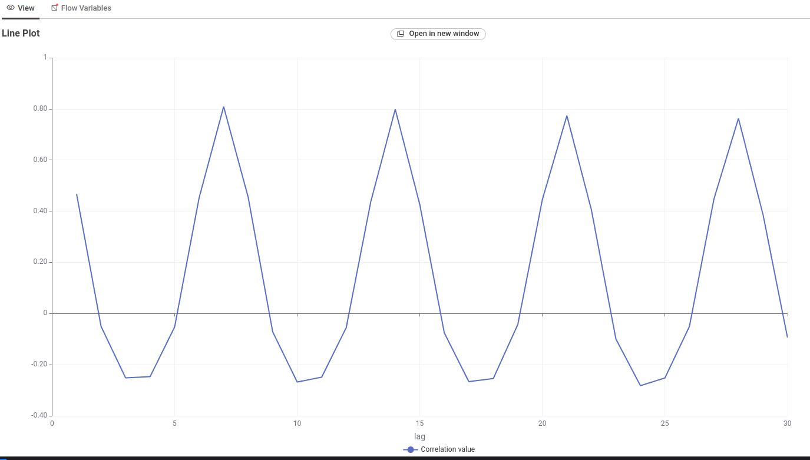
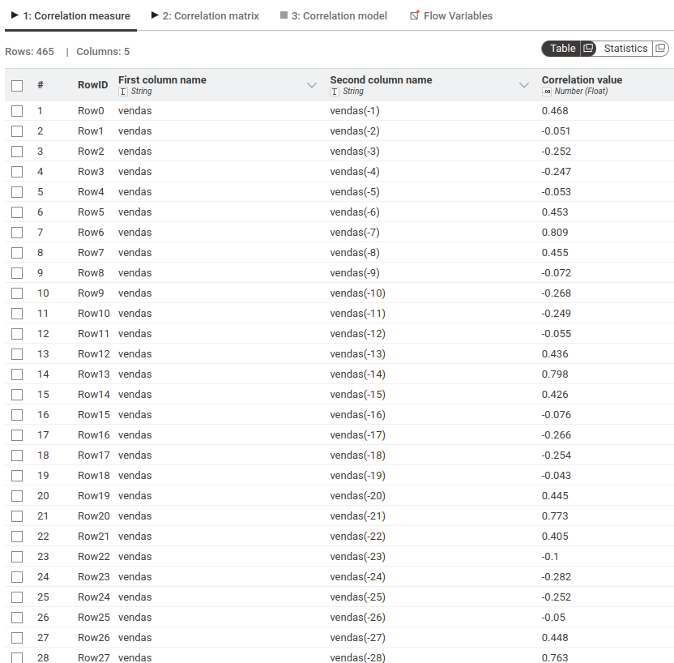
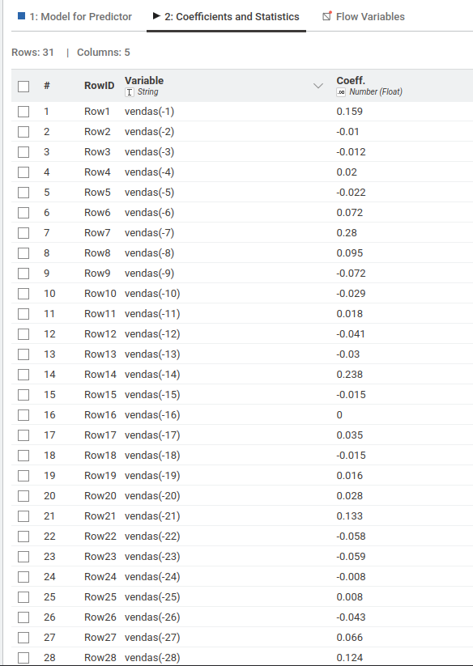
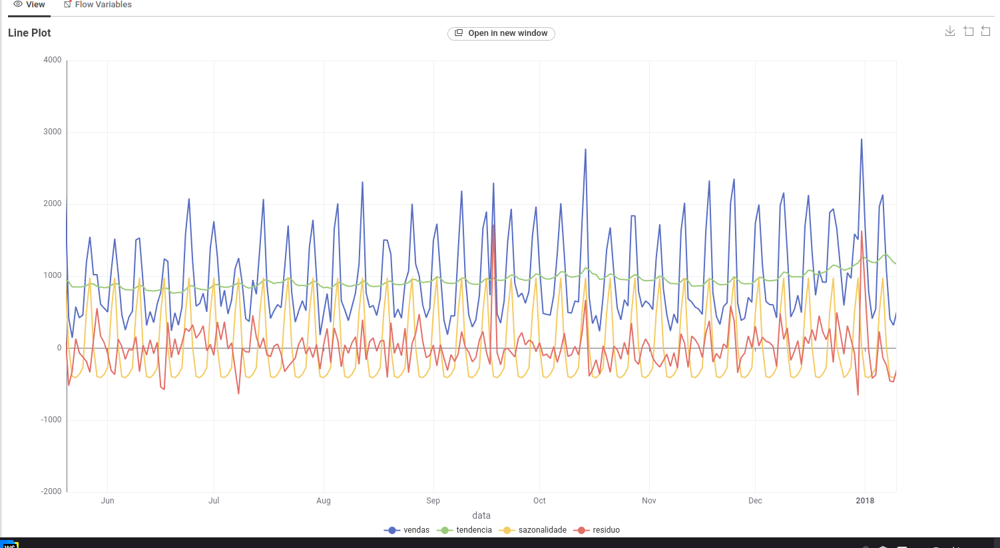
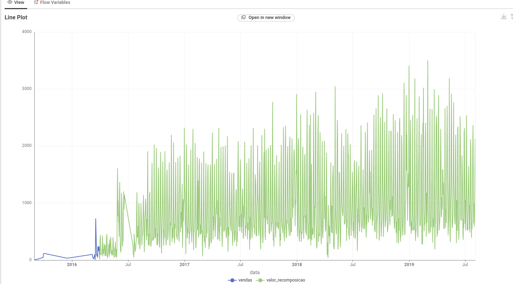

Este trabalho esta disponível no git: https://github.com/echer/26E2-infnet-trabalho-pd-mineracao-de-dados-para-series-temporais.git.

Este trabalho tem como objetivo aplicar técnicas de mineração de dados para séries temporais utilizando a plataforma KNIME. Foram utilizadas técnicas de análise exploratória, decomposição temporal, autocorrelação e modelagem ARIMA para análise e previsão de séries temporais.

A base de dados escolhida contém informações de pedidos realizados em um restaurante ao longo do tempo. Essa base foi selecionada por possuir uma variável temporal (Order Date) e diversas variáveis quantitativas relacionadas às vendas, tornando-a adequada para análise de séries temporais.

Além disso, a base apresenta forte comportamento sazonal, variações de demanda e tendência temporal, características importantes para aplicação de técnicas de previsão e decomposição temporal.

# Dataset
Para este trabalho estou utilizando o dataset do kaggle `Takeaway Food Orders` disponível no link: https://www.kaggle.com/datasets/henslersoftware/19560-indian-takeaway-orders.

# Estrutura dos dados
| Variável       | Tipo       | Descrição                              |
| -------------- | ---------- | -------------------------------------- |
| Order Number   | Discreta   | Número identificador do pedido         |
| Order Date     | Temporal   | Data e hora do pedido                  |
| Item Name      | Categórica | Nome do produto vendido                |
| Quantity       | Discreta   | Quantidade vendida do item             |
| Product Price  | Contínua   | Preço unitário do produto              |
| Total Products | Discreta   | Quantidade total de produtos no pedido |
| Order ID       | Discreta   | Identificador único do pedido          |

| Variável       | Média      | Desvio Padrão | Mínimo | Máximo |
| -------------- | ---------- | ------------- | ------ | ------ |
| Order Number   | 9.115,548  | 4.052,163     | 630    | 16.118 |
| Quantity       | 1,247      | 0,732         | 1      | 32     |
| Product Price  | 5,177      | 3,260         | 0,5    | 17,95  |
| Total Products | 7,125      | 3,375         | 1      | 60     |
| Order ID       | 15.185,998 | 6.088,428     | 2.096  | 25.583 |

As variaveis `Order Number`, `Order ID`, `Total Products` foram removidas no knime.

Foi criado uma nova coluna com o total chamada: `revenue`, multiplicando o `Quantity` pelo `Product Price`

A partir da coluna `Order Date` foi criado as colunas: `day_of_week`, `month`, `day_of_year`.

Os dados da coluna `Order Date` também foi modificada removendo a hora e deixando apenas a data. Antes yyyy-MM-dd HH:mm, após apenas yyyy-MM-dd.

As colunas `Order Date` e `revenue` foram renomeadas para `data`, `valor`.

E esta foi a análise inicial realizada no knime:

A partir dos dados prontos foram feitos a decomposição manual da coluna `valor` nas colunas `tendencia`, `sem_tendencia`, `sazonalidade` e `residuo`.

### Existe sazonalidade nas vendas do restaurante ao longo da semana?
A análise temporal permitiu identificar padrões repetitivos de consumo, mostrando quais dias da semana apresentam maior ou menor volume de vendas. No presente trabalho, observou-se forte sazonalidade semanal, com aumento significativo das vendas aos finais de semana, principalmente sexta e sábados.

### As vendas do restaurante apresentam tendência de crescimento ou queda ao longo do tempo?
A decomposição temporal permitiu identificar a tendência da série temporal utilizando médias móveis. Com isso, foi possível verificar o comportamento de longo prazo das vendas e confirmar uma tendencia de crescimento no faturamente ao longo da serie temporal.

# Processo Estocástico
Processo estocástico é um processo que possui comportamento aleatório ao longo do tempo, apresentando incertezas e variações imprevisíveis. No nosso caso as vendas do restaurante podem ser consideradas um processo estocástico, pois sofrem influência de diversos fatores externos, como clima, promoções, feriados e comportamento dos clientes.

# Processo Deterministico
Processo determinístico é um processo cujo comportamento pode ser previsto de maneira exata a partir de regras fixas, sem presença de aleatoriedade. Nesse tipo de processo, os mesmos valores de entrada sempre produzem os mesmos resultados, é como se uma variavel tenha uma forte correlação com a outra, quando uma aumenta a outra também ou quando diminui.

# Sazonalidade Estocástica
Sazonalidade estocástica ocorre quando os padrões sazonais apresentam comportamento repetitivo, porém com intensidade variável ao longo do tempo. No nosso caso, por exemplo, os finais de semana normalmente possuem maior volume de vendas, mas essa intensidade pode variar entre diferentes períodos.

# Sazonalidade Determinística
Sazonalidade determinística ocorre quando os padrões sazonais se repetem de forma fixa e previsível ao longo do tempo, mantendo comportamento praticamente constante entre os ciclos temporais.

# Sazonalidade aditiva vs multiplicativa
Na sazonalidade aditiva, a amplitude do componente sazonal permanece aproximadamente constante ao longo do tempo. O efeito sazonal é somado à tendência da série temporal (Y=T+S+R).

Na sazonalidade multiplicativa, o efeito sazonal varia proporcionalmente ao nível da série temporal. Quanto maior a série, maior tende a ser a amplitude da sazonalidade.

# Gráficos
Foram construídos gráficos temporais utilizando a variável temporal data no eixo X e as variáveis quantitativas no eixo Y, permitindo analisar o comportamento temporal das vendas, tendência, sazonalidade e ruido da série ao longo do tempo. Os gráficos mostraram crescimento gradual das vendas e forte comportamento sazonal semanal.

# Gráfico ACF

Foram observados picos significativos nos lags 7, 14, 21 e 28, evidenciando comportamento sazonal semanal.

Foram utilizados gráficos de autocorrelação (ACF Plot) para analisar a dependência temporal das variáveis ao longo do tempo.

# Gráfico PACF
O gráfico de autocorrelação parcial (PACF) foi utilizado para identificar quais defasagens possuem influência direta sobre a série temporal de vendas.
Os resultados mostraram maior influência nos lags 1, 7, 14, 21 e 28, evidenciando forte sazonalidade semanal e dependência temporal direta entre observações separadas por múltiplos de 7 períodos.
Os coeficientes intermediários apresentaram baixa magnitude, indicando que boa parte da dependência temporal da série é explicada pela estrutura sazonal semanal.

# Gráfico decomposição
A série temporal foi decomposta manualmente em três componentes principais: Tendência, sazonalidade e resíduo.

A tendência foi calculada utilizando média móvel de 30 períodos. A sazonalidade foi obtida agrupando os valores detrended (sem_tendencia) por dia da semana (day_of_week). O resíduo foi calculado pela diferença entre a série original e os componentes estimados.

# Gráfico recomposição
A recomposição da série apresentou valores muito próximos da série original, validando a decomposição realizada.

# TODO GRAFICO ARIMA
Foi utilizado o componente ARIMA Learner do KNIME para treinamento do modelo ARIMA aplicado à série temporal de vendas. A seleção do melhor modelo foi realizada utilizando o critério AIC (Akaike Information Criterion), buscando minimizar a perda de informação do modelo.

Após o treinamento, foi utilizado o componente ARIMA Predictor para geração de previsões futuras (forecast) da série temporal.

Os resíduos do modelo foram avaliados utilizando o componente Analyze ARIMA Residuals, permitindo verificar o comportamento aleatório dos erros e validar a qualidade estatística do modelo.

# TODO CONTINUAR AQUI

ARIMA	⚠️ falta executar
Forecast	⚠️ falta executar
Analyze Residuals	⚠️ falta executar

PERGUNTAS
Antes de fazer sua entrega, reúna todos os arquivos relativos ao seu Projeto de Disciplina em um único arquivo no formato .zip e poste no Moodle. Utilize o seu nome para nomear o arquivo, identificando também a disciplina, como no exemplo: “nomedoaluno_nomedadisciplina_pd.zip”.
R:

AVALIAÇÃO
1. Utilizar uma base de dados temporal armazenada em formato CSV ou SQL
   O Aluno escolheu uma base de série temporal?
1. Utilizar uma base de dados temporal armazenada em formato CSV ou SQL
   O aluno ilustrou os problemas que ele pode resolver com a base?
1. Utilizar uma base de dados temporal armazenada em formato CSV ou SQL
   O aluno descreveu as váriaveis presentes na série?
1. Utilizar uma base de dados temporal armazenada em formato CSV ou SQL
   O aluno usou medidas estatísticas para descrever a série?
2. Explorar dados com a plataforma Knime
   O Aluno apresentou um print demonstando ter o Knime instalado no computador?
2. Explorar dados com a plataforma Knime
   O aluno mostrou um print demonstrando ter os componentes necessários no computador?
2. Explorar dados com a plataforma Knime
   O aluno mostrou um print demonstrando ter python instalado no computador?
2. Explorar dados com a plataforma Knime
   O aluno mostrou um print demonstrando que a integração KNIME com Python funciona?
3. Identificar a diferença entre processos determinísticos e estocásticos
   O Aluno explicou o que é um processo estocástico?
3. Identificar a diferença entre processos determinísticos e estocásticos
   O Aluno explicou o que é um processo deterministico?
3. Identificar a diferença entre processos determinísticos e estocásticos
   O Aluno explicou o que é a sazonalidade estocástica?
3. Identificar a diferença entre processos determinísticos e estocásticos
   O aluno explicou a diferença entre sazonalidade estocástica e deterministica?
3. Identificar a diferença entre processos determinísticos e estocásticos
   O Aluno explicou o que é a sazonalidade deterministica?
4. Criar gráficos com séries temporais
   O aluno criou um gráfico temporal para cara variável da base de dados
4. Criar gráficos com séries temporais
   O Aluno criou um gráfico da função de autocorrelação para cada série da base de dados?
4. Criar gráficos com séries temporais
   O Aluno criou um gráfico da função de correlação parcial para cada série da base de dados?
4. Criar gráficos com séries temporais
   O aluno criou um gráfico das séries decompostas para cada variável da base de dados?
5. Calcular a tendência e a sazonalidade de séries temporais para diferentes bases de dados
   O aluno usou o componente Decompose Signal para remover a tendência de todas as séries do trabalho?
5. Calcular a tendência e a sazonalidade de séries temporais para diferentes bases de dados
   O aluno usou o componente Decompose Signal para remover a sazonalidade de todas as séries do trabalho?
5. Calcular a tendência e a sazonalidade de séries temporais para diferentes bases de dados
   O aluno criou um modelo ARIMA?
5. Calcular a tendência e a sazonalidade de séries temporais para diferentes bases de dados
   O aluno avaliou o modelo usando IAC?
5. Calcular a tendência e a sazonalidade de séries temporais para diferentes bases de dados
   O Aluno realizou um forecast de dados?
5. Calcular a tendência e a sazonalidade de séries temporais para diferentes bases de dados
   O Aluno avaliou o resíduo da predição do modelo ARIMA?
